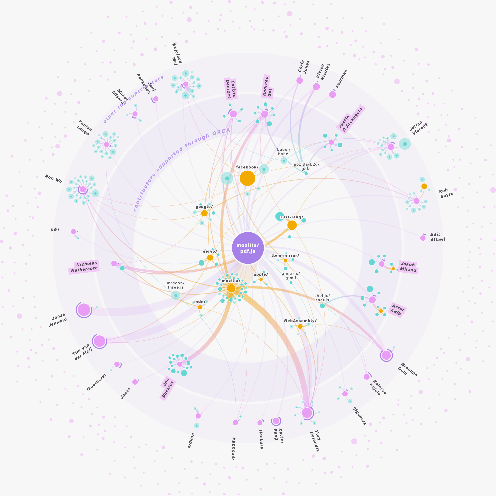

# The Top Contributor Network

This visualization shows how top contributors to a specific Github repository are connected to the (other) repositories that they have made commits to.



## Setting up the chart

**The network** depends on [**d3.js**](https://github.com/d3/d3) and two of its plugins; [**d3-delaunay**](https://github.com/d3/d3-delaunay) (for mouse hovers and clicks) and [**d3-bboxCollide**](https://github.com/emeeks/d3-bboxCollide) (for non-overlap of both the circles and textual labels). Finally, there is the custom **createORCAVisual.js** file that needs to be included.

```html
<!-- JavaScript libraries -->
<script src="lib/d3.v7.js"></script>
<script src="lib/d3-delaunay.js"></script>
<script src="lib/d3-bboxCollide.min.js"></script>

<!-- Custom JavaScript file -->
<script src="createORCAVisual.js"></script>
```

First initialize the chart. This will not yet draw anything

```js
const REPOSITORY_FULL = "mozilla/pdf.js"

// Get the div container that will hold the chart
const container = document.getElementById("chart-wrapper")
// Get the width of the container
let width = container.offsetWidth
// You can set the height to anything you want
// But the same as the width is the default
let height = width

// Set-up the visual - Doesn't draw anything yet, but does create the 3 canvas elements of the visual into the container element
let ORCAVisual = createORCAVisual(container)
    .width(width)
    .height(height)
    .repository(REPOSITORY_FULL)
```

Next, you read in the datasets and supply it to the function. The specifics of the four datasets are explained further down below.

```js
////////////////// Datasets to Read in //////////////////
// It requires three datasets (and one optional one) of contributors (authors), repositories, links between contributors and repositories, and remaining contributors, in that order

let promises = []
promises.push(d3.csv(`data/pdfjs/top_contributors.csv`))
promises.push(d3.csv(`data/pdfjs/repositories.csv`))
promises.push(d3.csv(`data/pdfjs/links.csv`))
promises.push(d3.csv(`data/pdfjs/remaining_contributors.csv`))

// Read in the data and create the visual
Promise.all(promises).then(values => {
    ORCAVisual(values)
})//promises
```
